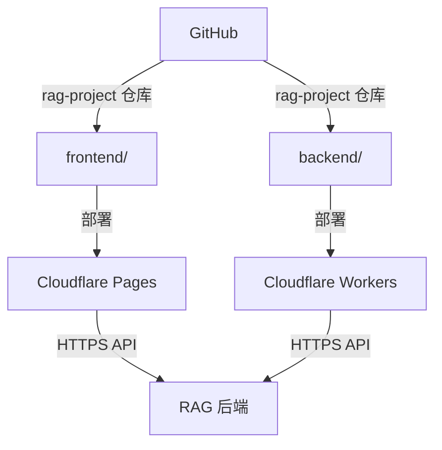

# reader
基于 Cloudflare Workers + Vue + Embedding + Vector Store + LLM 实现的个人 RAG 知识库。

## Project Structure

frontend/   前端
backend/    RAG API 后端

## Deployment

Frontend → Cloudflare Pages
Backend  → Cloudflare Workers

## 目录结构

rag-project/
│
├── frontend/
│   └── index.html
│
├── backend/
│   ├── src/
│   │   ├── index.js
│   │   ├── rag.js
│   │   ├── chunking.js
│   │   ├── embedding.js
│   │   ├── retrieval.js
│   │   ├── vector-store.js
│   │   ├── document-parser.js
│   │   └── llm.js
│   │
│   ├── package.json
│   └── wrangler.toml
│
└── README.md

## 部署关系

